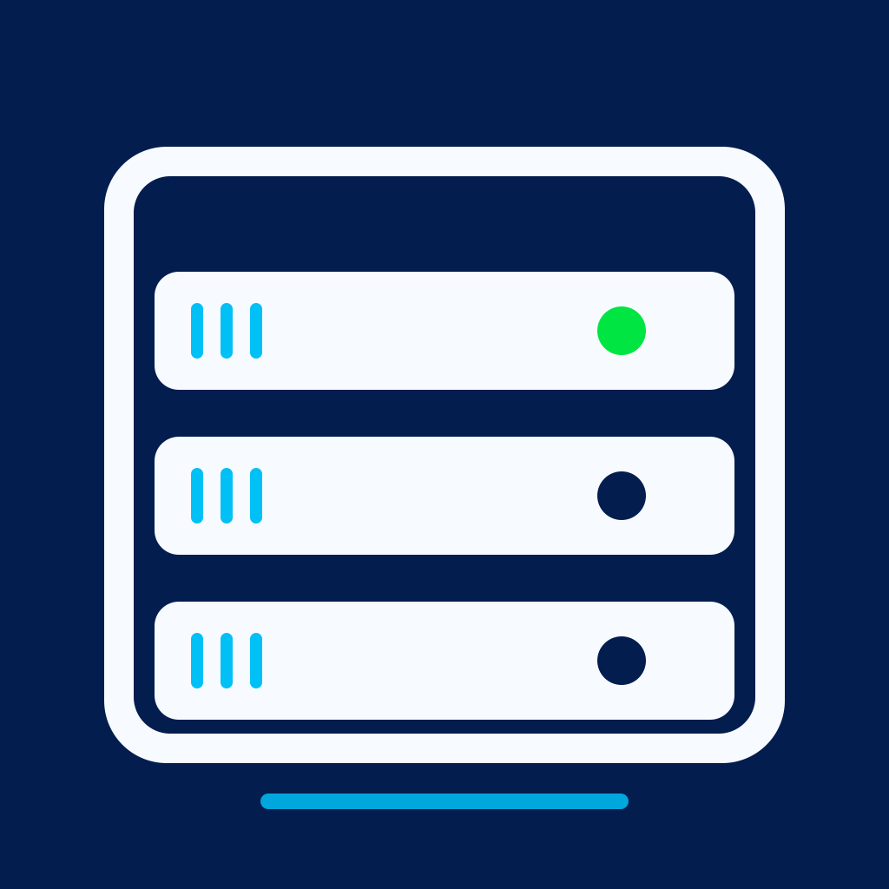

  

# Proxmox Manager

**Put Proxmox VE in your pocket.**

A native Proxmox VE management client built for iPhone and iPad. 
Monitor your cluster, manage virtual machines and containers, and handle everyday operations securely from anywhere.

English · [简体中文](README_zhCN.md)

## Your Proxmox cluster, always within reach

Proxmox Manager connects directly to your Proxmox VE server and presents nodes, virtual machines, LXC containers, storage, and tasks in an interface designed for iOS. There is no desktop web interface squeezed onto a phone and no third-party relay between your device and your server.

Whether you are checking cluster health, responding to an unavailable guest, or provisioning a new workload, the controls you need stay clear and close at hand.

## Features

| | |
|---|---|
| **Cluster and nodes** | Monitor multiple nodes, uptime, load, CPU, memory, and disk usage. |
| **Virtual machines and containers** | Browse QEMU virtual machines and LXC containers together, with search and filters for name, VMID, node, and status. |
| **Lifecycle controls** | Start, reboot, gracefully shut down, or force-stop guests with confirmation for destructive actions. |
| **Create and configure** | Create, edit, delete, and fully clone virtual machines and containers. Adjust CPU, memory, boot behavior, and other options. |
| **Hardware management** | Inspect and manage disks and network interfaces, including disk expansion and network configuration. |
| **Cloud-Init** | Configure users, SSH keys, DNS, package upgrades, and IPv4 / IPv6 networking. |
| **Snapshots** | Create, roll back, and delete snapshots, with optional virtual machine state capture. |
| **Storage and backups** | Review storage capacity, usage, and content, plus backup schedules and available archives. |
| **Installation media** | Import an ISO from a URL or browse and download Proxmox LXC appliance templates. |
| **Performance charts** | Explore CPU, memory, network, and disk history for nodes and guests across hourly, daily, and weekly ranges. |
| **Task center** | Follow long-running Proxmox tasks, inspect results and logs, and cancel tasks that are still running. |

## Secure by design

- Password, API Token, and TOTP authentication
- Passwords, token secrets, and certificate fingerprints stored in iOS Keychain
- Support for certificates issued by trusted certificate authorities
- Explicit SHA-256 fingerprint confirmation for self-signed certificates
- Automatic rejection when a pinned certificate changes
- Optional Face ID lock with an automatic privacy cover in the background
- Automatic reauthentication when a password-based session expires
- Direct device-to-server connections with no cloud relay

## A native mobile experience

- SwiftUI interface designed for iPhone and iPad
- English and Simplified Chinese localization
- Foreground auto-refresh and pull-to-refresh
- Permission-aware controls based on the connected Proxmox account
- Clear confirmation for force stop, deletion, snapshot rollback, and other high-risk operations
- Dark Mode, Dynamic Type, and familiar system interactions

## Compatibility

- iOS / iPadOS 16.0 or later
- Proxmox VE 6.0 or later
- Single-node installations and multi-node clusters
- Password or API Token authentication

Some management features require the corresponding Proxmox VE privileges. When an account lacks permission, the app hides the unavailable action or explains why it cannot be performed.

## Privacy

Proxmox Manager contains no advertising or user tracking and does not collect personal data. Server details and credentials remain on your device, while operational data is retrieved directly from the Proxmox VE servers you configure.

## Disclaimer

Proxmox Manager is an independently developed third-party client and is not affiliated with or endorsed by Proxmox Server Solutions GmbH. Proxmox and Proxmox VE are trademarks of their respective owner.

## License

This project is available under the [MIT License](LICENSE).
